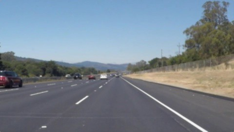
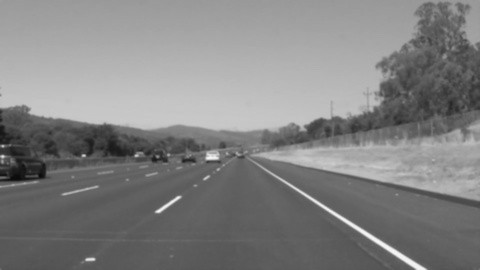
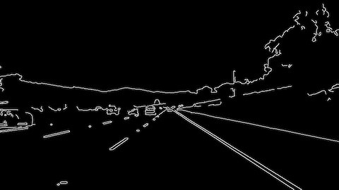
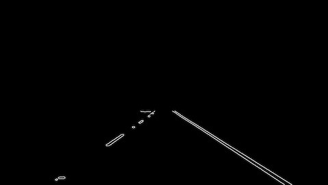
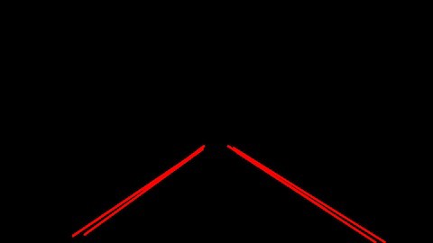
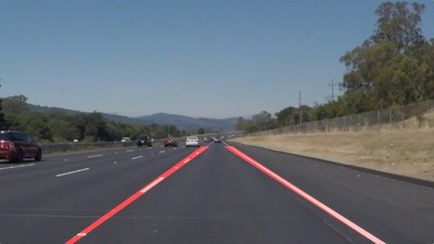
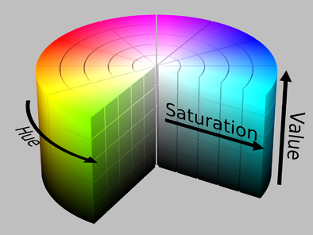
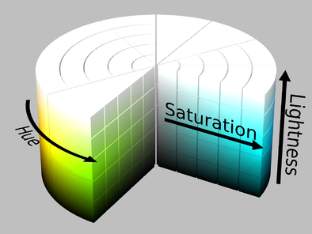
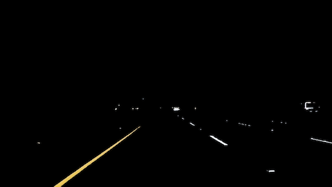
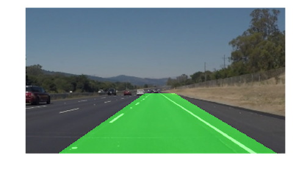

# **A Lane Detection Approach for Self-Driving Vehicles**

Traffic accidents have become one of the most serious problems in today’s world. Increase in the number of vehicles, human errors towards traffic rules and the difficulty to oversee situational dangers by drivers are contributing to the majority of accidents on the road. Lane detection is an essential component for autonomous vehicles. In this paper, I have designed and implemented an automatic lane marking detection algorithm. Various experiments in a U.S. context show that the proposed approach can be very effective in lane detection. The algorithm is verified for both white lanes and yellow lanes by improving color detection and averaging temporal patterns.

## Getting Started
We will develop a simple pipeline using OpenCV and Python for finding lane lines in an image, then apply this pipeline to a full video feed. Udacity’s Self-Driving Car program got me started with these skills and I highly recommend this program if you want to get into this field.

We will be leveraging the popular SciPy and NumPy packages for doing scientific computations and the OpenCV package for computer vision algorithms:

```python
import matplotlib.pyplot as plt
import numpy as np
import cv2
```

## Lane Detection Pipeline
The first iteration of the lane detection algorithm works well on non-curved roads with a main camera mounted on the vehicle dashboard. In these videos, the weather conditions are good and it is daytime. We will handle shadows, continuous and discontinuous lanes with different colors.

**Remove noise:** Starting with a frame from a video taken from a single camera on the dashboard, we clean up the image by applying a Gaussian blur. This step will remove noise and tiny details from the image such as distant objects that are irrelevant for our purpose.

```python
def remove_noise(image, kernel_size):
    return cv2.GaussianBlur(image, (kernel_size, kernel_size), 0)
```



**Discard color information:** The second step is to convert the image to grayscale before isolating the region of interest. This step will highlight pixels with a higher brightness value, including the ones defining marking lanes in the frame.

```python
def discard_colors(image):
    return cv2.cvtColor(image, cv2.COLOR_BGR2GRAY)
```




**Detect edges:** The next step is to run Canny edge detection. The Canny algorithm detects edges on a picture by looking for quick changes in color between a pixel and its neighbors. The blur and grayscale step will help make the main lane lines stand out. The result will give a black and white image.

```python
def detect_edges(image, low_threshold, high_threshold):
    return cv2.Canny(image, low_threshold, high_threshold)
```



**Region of interest**: It’s important to cut out as much of the noise as possible within a frame. Given the position and orientation of the camera, we can assume that lanes will be located in the lower half of the image. We can just isolate that area using a trapezoid shape. While it may be tempting to hardcode the best possible place to look for lines, lines can move around as you drive. For this reason, a simple ratio to setup a polygonial shape is used. We apply a generous ratio as we don’t want our region to be too narrow resulting in missing lanes out of the region of interest.

```python
def region_of_interest(image, vertices):
    # defining a blank mask to start with
    mask = np.zeros_like(image)
   
    # defining a 3 channel or 1 channel color to fill the mask with depending on the input image
if len(image.shape) > 2:
        channel_count = image.shape[2]  # i.e. 3 or 4 depending on your image
        ignore_mask_color = (255,) * channel_count
    else:
        ignore_mask_color = 255
    # filling pixels inside the polygon defined by "vertices" with the fill color
    cv2.fillPoly(mask, vertices, ignore_mask_color)
    # returning the image only where mask pixels are non-zero
    masked_image = cv2.bitwise_and(image, mask)
    return masked_image

xsize = img.shape[1]
ysize = img.shape[0]
dx1 = int(0.0725 * xsize)
dx2 = int(0.425 * xsize)
dy = int(0.6 * ysize)
# calculate vertices for region of interest
vertices = np.array([[(dx1, ysize), (dx2, dy), (xsize - dx2, dy), (xsize - dx1, ysize)]], dtype=np.int32)
image = region_of_interest(image, vertices)
```



**Hough transform**: Using probabilistic Hough lines, we identify the location of lane lines on the road. The Hough transform algorithm extracts all the lines passing through each of our edge points and group them by similarity. The HoughLinesP function in OpenCV returns an array of lines organized by endpoints (x1, x1, x2, x2). It’s important to understand that we are no longer viewing point in the (x, y) cartesian coordinate system but are now viewing points in the (ρ, θ) polar coordinate system that the Hough transform operates in. Understanding the internals of this transform helps manipulating parameters provided to the function.


```python
def hough_lines(image, rho, theta, threshold, min_line_len, max_line_gap):
    lines = cv2.HoughLinesP(image, rho, theta, threshold, np.array([]), minLineLength=min_line_len, maxLineGap=max_line_gap)
    return lines

rho = 0.8
theta = np.pi/180
threshold = 25
min_line_len = 50
max_line_gap = 200
lines = hough_lines(img, rho, theta, threshold, min_line_len, max_line_gap)
```



**Sort lines**: The Hough transformation gives us back multiple lines, but we only want two distinct lanes for our car to drive in between. We have two distinct sets we want to detect: the left and the right lane markers. In this section, we organize lines by slope. The slope of a line is given by:

 / (x2 - x1)")

We use this equation to organize lines by their slope. Positive slopes are for the right lane and negative slopes are for the left lane.

```python
def separate_lines(lines):
    right = []
    left = []
    for x1,y1,x2,y2 in lines[:, 0]:
        m = get_slope(x1,y1,x2,y2)
        if m >= 0:
            right.append([x1,y1,x2,y2,m])
        else:
            left.append([x1,y1,x2,y2,m])
    return right, left

right_lines, left_lines = separate_lines(lines)
```

**Reject outliers**: We then reject lines with unacceptable slopes that throw off the intended slope of each line.

```python
def reject_outliers(data, cutoff, thresh=0.08):
    data = np.array(data)
    data = data[(data[:, 4] >= cutoff[0]) & (data[:, 4] <= cutoff[1])]
    m = np.mean(data[:, 4], axis=0)
    return data[(data[:, 4] <= m+thresh) & (data[:, 4] >= m-thresh)]

if len(right_lines) != 0 and len(left_lines) != 0:
    right = reject_outliers(right_lines,  cutoff=(0.45, 0.75))
    left = reject_outliers(left_lines, cutoff=(-0.85, -0.6))
```

**Run linear regression**: We finally merge left and right sets using linear regression. Linear regression is an attempt at finding the best relationship between a group of points. We are getting a line that passes at the closest possible distance from each point. We apply linear regresion on both the left and right sets of lines.

```python
def lines_linreg(lines_array):
    x = np.reshape(lines_array[:, [0, 2]], (1, len(lines_array) * 2))[0]
    y = np.reshape(lines_array[:, [1, 3]], (1, len(lines_array) * 2))[0]
    A = np.vstack([x, np.ones(len(x))]).T
    m, c = np.linalg.lstsq(A, y)[0]
    x = np.array(x)
    y = np.array(x * m + c)
    return x, y, m, c

x, y, m, c = lines_linreg(lines)
# This variable represents the top-most point in the image where we can reasonable draw a line to.
min_y = np.min(y)
# Calculate the top point using the slopes and intercepts we got from linear regression.
top_point = np.array([(min_y - c) / m, min_y], dtype=int)
# Repeat this process to find the bottom left point.
max_y = np.max(y)
bot_point = np.array([(max_y - c) / m, max_y], dtype=int)
```


**Span lines**: Using some simple geometry (y = mx + b), we calculate extrema. We use the result of the linear regression to extrapolate to those extrema. We extend the left and right lines off across the image and clip the line using our previous region of interest.


```python
def extend_point(x1, y1, x2, y2, length):
    line_len = np.sqrt((x1 - x2)**2 + (y1 - y2)**2)
    x = x2 + (x2 - x1) / line_len * length
    y = y2 + (y2 - y1) / line_len * length
    return x, y

x1e, y1e = extend_point(bot_point[0],bot_point[1],top_point[0],top_point[1], -1000) # bottom point
x2e, y2e = extend_point(bot_point[0],bot_point[1],top_point[0],top_point[1],  1000) # top point
# return the line.
line = np.array([[x1e,y1e,x2e,y2e]])
return np.array([line], dtype=np.int32)
```

**Draw the lines and return the final image**: The final step is to superimpose the left and right lines onto the original image to visually validate the correctness and accuracy of our pipeline implementation.

```python
def weighted_image(image, initial_image, α=0.8, β=1., λ=0.):
    return cv2.addWeighted(initial_image, α, image, β, λ)

line_image = np.copy((image)*0)
draw_lines(line_image, lines, thickness=3)
line_image = region_of_interest(line_image, vertices)
final_image = weighted_image(line_image, image)
return final_image
```




[](https://www.youtube.com/watch?v=QfpBr-Vb0dY)


# Advanced Techniques

## Color Transform

In the above version of the pipeline, we decided to discard color information and rely exclusively on pixel brightness to detect lane marking on the road. It works well during daylight and with a simple terrain but we observed that the lane detection accuracy drops significantly in less ideal conditions. By transforming the original image from RGB colorspace to HSL colorspace, we want to filter out pixels which are not the given color of the lanes. Using hue and saturation values, not how dark a pixel is, will ensure lines of a given color are more easily detected in shaded or low-contrast regions.

HSV             |  HSL
:-------------------------:|:-------------------------:
  |  

```python
def select_yellow_white(img):
    hsv_img = cv2.cvtColor(img, cv2.COLOR_RGB2HLS)

    # yellow color mask
    lower_range = np.uint8([ 15,  38, 115])
    upper_range = np.uint8([ 35, 204, 255])
    yellow_mask = cv2.inRange(hsv_img, lower_range, upper_range)

    # white color mask
    lower_range = np.uint8([  0, 200,   0])
    upper_range = np.uint8([180, 255, 255])
    white_mask = cv2.inRange(hsv_img, lower_range, upper_range)

    combined_mask = white_mask | yellow_mask
    masked_image = cv2.bitwise_and(img, img, mask=combined_mask)
    return masked_image
```



<p>Now for the one with the solid yellow lane on the left:</p>


[](https://www.youtube.com/watch?v=4frniOSAVGU)


## Variable Region of Interest

For different sizes of images, we need not to hardcode the region of interest. Based on several images, these values work well:

```python
    ysize, xsize = original_image.shape[:2]
    dx1 = int(0.0725 * xsize)
    dx2 = int(0.425 * xsize)
    dy = int(0.6 * ysize)
    vertices = np.int32([[(dx1, ysize), (dx2, dy), (xsize - dx2, dy), (xsize - dx1, ysize)]])
```


**Now for the video with the solid yellow lane on the left**:





## Automatic Canny Parameters

We can use the computed median on the grayscale image. Canny recommended a ration of (2:1) or even (3:1) between the low and high threshold values. Using a sigma value, we are able to compute these threshold.

```python
def find_edges(img, sigma=0.33):
    # compute the median of the single channel pixel intensities
    v = np.median(image)
    # apply automatic Canny edge detection using the computed median
    lo = int(max(0, (1.0 - sigma) * v))
    hi = int(min(255, (1.0 + sigma) * v))
    return canny(img, lo, hi)
```

Another option (which I haven't tried) would be to calculate thresholds using Otsu´s method:

```python
high_threshold, thresh_image = cv2.threshold(image, 0, 255, cv2.THRESH_BINARY + cv2.THRESH_OTSU)
lowThresh = 0.5*high_threshold
```

Here is the complete pipeline calling these new methods:

```python
def pipeline(original_image):
    ysize, xsize = original_image.shape[:2]
    dx1 = int(0.0725 * xsize)
    dx2 = int(0.425 * xsize)
    dy = int(0.6 * ysize)
    vertices = np.int32([[(dx1, ysize), (dx2, dy), (xsize - dx2, dy), (xsize - dx1, ysize)]])

    output_image = select_yellow_white(original_image)
    output_image = grayscale(output_image)
    output_image = gaussian_blur(output_image, 3)
    output_image = find_edges(output_image)
    output_image = region_of_interest(output_image, vertices)

    lines_image = hough_lines(output_image, 1, (np.pi/180), 20, 20, 300)
    lines_image = region_of_interest(lines_image, vertices)
    final_image = weighted_img(lines_image, original_image)
    return final_image
```


## Previous Frame Averaging
On the video footage, we will average the previous frame lines with the current frame lines to improve our lane detection algorithm. Remembering each last frame lines will prevent jittery using average and provide a solution when our pipeline fails to detect lines in less than ideal conditions.

```python
prev_left, prev_right = None

def pipeline(image):
    global prev_left
    global prev_right
	
	right = reject_outliers(right_lines,  cutoff=(0.45, 0.75))
	if len(right) != 0:
	    right = merge_lines(right)
	    right = merge_prev(right, prev_right)
	    prev_right = right
	else:
	    right = prev_right
	left = reject_outliers(left_lines, cutoff=(-0.85, -0.6))
	if len(left) != 0:
	    left = merge_lines(left)
	    left = merge_prev(left, prev_left)
	    prev_left = left
	else:
	    left = prev_left
```

## Using Circular Buffer To Average Slopes & Intersects


A more advanced method consist of keeping the last few line computations out of the linear regression method and calculate the new average with the new values. When some frames are too dark to interpret or the lanes are curved, this method ensures that we have previous parameters to use for the current frame. This also results in less jitter and a smoother line detection.

Below are the functions we updated to implement this method:

```python
from collections import deque

previous_positive_slopes = previous_positive_intercepts = None
previous_negative_slopes = previous_negative_intercepts = None

def compute_lane(img, lines, slopes, intercepts):
    
    if len(lines) > 0: 
        x, y, m, c = lines_linear_regression(lines)
        slopes.append(m)
        intercepts.append(c)
    
    m = np.mean(slopes)     # Tried median with no particular improvements
    c = np.mean(intercepts)
    
    y1 = int(img.shape[0]/2)
    x1 = int((y1 - c)/m)
    y2 = int(img.shape[0])
    x2 = int((y2 - c)/m)

    x1e, y1e = extend_point(x1,y1,x2,y2, -1000) # bottom point
    x2e, y2e = extend_point(x1,y1,x2,y2, 1000)  # top point
    
    lane = np.array([x2e, y2e, x1e, y1e], dtype=np.int32)
    return lane

def extrapolate_lines(img, lines):
    global previous_positive_slopes
    global previous_positive_intercepts
    global previous_negative_slopes
    global previous_negative_intercepts

    right_lines, left_lines = separate_lines(lines)

    if len(right_lines) == 0 or len(left_lines) == 0:
        return

    right = reject_outliers(right_lines, cutoff=(0.45, 0.75))
    left  = reject_outliers(left_lines,  cutoff=(-1.1, -0.2))
    right_lane = compute_lane(img, right, previous_positive_slopes, previous_positive_intercepts)
    left_lane  = compute_lane(img, left,  previous_negative_slopes, previous_negative_intercepts)
    lines = np.array([np.array([right_lane]), np.array([left_lane])])
    return lines
```


Trying the ehnanced lane finding pipeline on the video below, we observe that it still works and provides a very stable line detection, even when the lanes are curved and in shaded areas:

[](https://www.youtube.com/watch?v=TOQ7f2UsJZg)

## Potential Shortcomings With Current Pipeline

One potential shortcoming with the current solution is the ability to treat image quality (weather, road conditions, absence of marking, etc.) Another shortcoming could be the positioning of the camera on the dashboard and its orientation because the region of interest doesn't adapt to different camera angles. Finally, the hough transform parameters are currently hardcoded and it would be best to be able to tweak those best on the image content.


## Possible Improvements To Pipeline

I'd like to learn how to implement deep learning to the sequence of videos to recognize lanes better. This would require a training set with more videos to be able to infer better the positions of the lines on the lanes.


Another possible improvement would be to account for the fact that lanes are curved and therefore using a second degree polynomial solution to map the curved lanes better.

## Conclusion

In this project, I have developed and implemented an algorithm for detecting white and yellow colored lanes on the road. The lane detection method is robust and effective in finding the exact lanes by using both color and edge orientations. The main contributions are the color segmentation procedure identifying the yellow or white colored lanes followed by edge orientation in which the boundaries are eliminated, lanes are detected, left and right regions are labeled, outliers are removed and finally one line per region remains after using a linear regression on each set. As the camera remains constant with respect to the road surface, the road portion of the image can be exclusively cropped by providing coordinates, so that identifying the lanes becomes much more efficient. The experimental results show the effectiveness of the proposed method in cases of yellow and white colored lanes. The entire work is done in a static way using static images and extended to detect lanes in videos.


